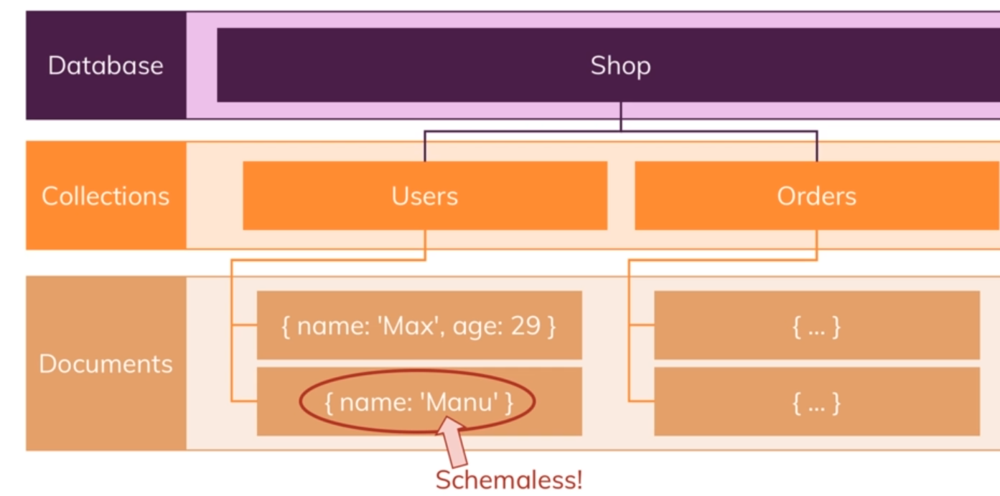
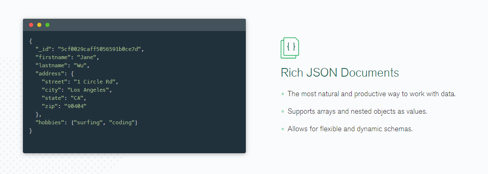
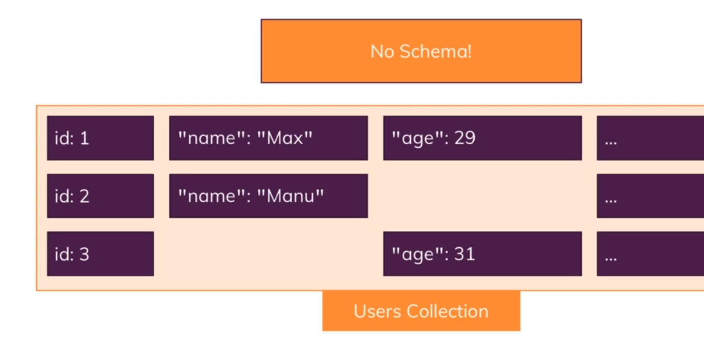
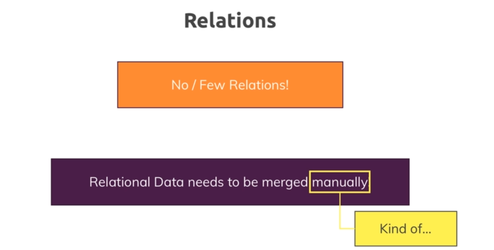
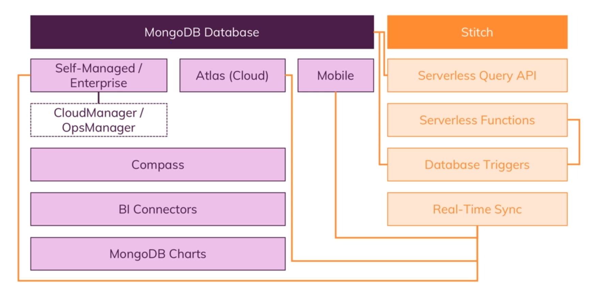

>what is Mongo-DB

MongoDB is a document database, which means it stores data in JSON-like documents. We believe this is the most natural way to think about data, and is much more expressive and powerful than the traditional row/column model.
___     
>How It Works

___
>Format

___
>BSON Data Structor

___
>Realations

___
>Mongo-DB Eco-System

